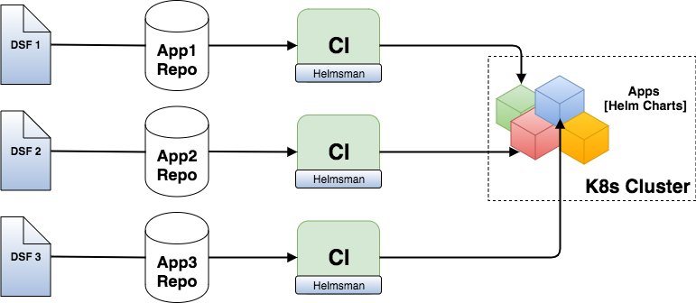

# Deployment Strategies 

This document describes the different startegies to use Helmsman for maintaining your helm charts deployment to k8s clusters.

## Deploying 3rd party charts (apps) in a production cluster

Suppose you are deploying 3rd party charts (e.g. Jenkins, Jira ... etc.) in your cluster. These applications can be deployed with Helmsman using a single desired state file. The desired state tells helmsman to deploy these apps into certain namespaces in a production cluster.  

You can test 3rd party charts in designated namespaces (e.g, staging) within the same production cluster. This also can be defined in the same desired state file. Below is an example of a desired state file for deploying 3rd party apps in production and staging namespaces:  

```
[metadata]
org = "example"

# using a minikube cluster
[settings]
kubeContext = "minikube" 

[namespaces]
  [namespaces.staging]
  protected = false
  [namespaces.production]
  protected = true

[helmRepos]
stable = "https://kubernetes-charts.storage.googleapis.com"
incubator = "http://storage.googleapis.com/kubernetes-charts-incubator"

[apps]

    [apps.jenkins]
    name = "jenkins-prod" # should be unique across all apps
    description = "production jenkins"
    namespace = "production" 
    enabled = true 
    chart = "stable/jenkins" 
    version = "0.9.1" # chart version
    valuesFile = "../my-jenkins-production-values.yaml" 


    [apps.artifactory]
    name = "artifactory-prod" # should be unique across all apps
    description = "production artifactory"
    namespace = "production" 
    enabled = true 
    chart = "stable/artifactory" 
    version = "6.2.0" # chart version
    valuesFile = "../my-artificatory-production-values.yaml" 
   

    # the jenkins release below is being tested in the staging namespace
    [apps.jenkins-test]
    name = "jenkins-test" # should be unique across all apps
    description = "test release of jenkins, testing xyz feature"
    namespace = "staging" 
    enabled = true 
    chart = "stable/jenkins" 
    version = "0.9.1" # chart version
    valuesFile = "../my-jenkins-testing-values.yaml" 

```

You can split the desired state file into multiple files if your deployment pipelines requires that, but it is important to read the notes below on using multiple desired state files with one cluster.

## Working with multiple clusters

If you use multiple clusters for multiple purposes, you need at least one Helmsman desired state file for each cluster. 


## Deploying your dev charts

If you are developing your own applications/services and packaging them in helm charts. It makes sense to automtically deploy these charts to a staging namespace or a dev cluster on every source code commit.

Often, you would have multiple apps developed in separate source code repositories but you would like to test their deployment in the same cluster/namespace. In that case, Helmsman can be used [as part of your CI pipeline](how_to/run_helmsman_in_ci.md) as described in the diagram below:



Each repository will have a Helmsman desired state file (DSF). But it is important to consider the notes below on using multiple desired state files with one cluster. 

If you need supporting applications (charts) for your application (e.g, reverse proxies, DB, k8s dashborad etc.), you can describe the desired state for these in a separate file which can live in another repository. Adding such file in the pipeline where you create your cluster from code makes total "DevOps" sense. 

## Notes on using multiple Helmsman desired state files with the same cluster

Helmsman works with a single desired state file at a time and does not maintain a state anywhere. i.e. it does not have any context awareness about other desired state files used with the same cluster. For this reason, it is the user's responsibility to make sure that:

- no releases have the same name in different desired state files pointing to the same cluster. If such conflict exists, Helmsman will not raise any errors but that release would be subject to unexpected behaviour.

- protected namespaces are defined protected in all the desired state files. Otherwise, namespace protection can be accidentally compromised if the same release name is used across multiple desired state files.

Also please refere to the [best parctice](best_practice.md) document. 
